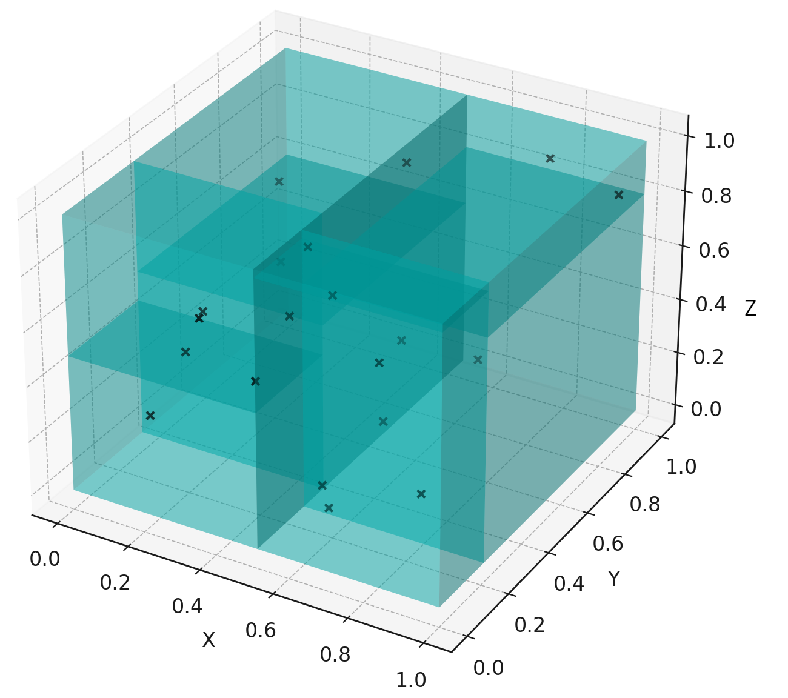

.. KDTree documentation master file, created by
   sphinx-quickstart on Sun Nov 23 23:01:20 2025.
   You can adapt this file completely to your liking, but it should at least
   contain the root `toctree` directive.

.. KDTree documentation master file

========
KD-Tree
========

A high-performance, lazily-built KD-Tree implementation for spatial partitioning of particles and triangle meshes in three-dimensional space. This library provides efficient ray-triangle intersection queries and is particularly suited for polyhedral geometry operations.

Here is a visualization of a KDTree partitioning a 3D space filled with particles:

|

This project supports partiioning of particles in 3D space as well as triangle meshes (polyhedra).

.. toctree::
   :maxdepth: 1
   :caption: Minimal Code Examples:
   :glob:
   
   examples/*

.. toctree::
   :maxdepth: 1
   :caption: Source Code Documentation:
   :glob:

   code_docs/*

Features
========

- **Lazy Construction**: KD-Tree nodes are built on-demand, optimizing memory usage and initialization time
- **Multiple Split Algorithms**: Choose from several plane selection strategies:

  - ``LOG`` - O(n log n) complexity (default, recommended)
  - ``LOGSQUARED`` - O(n log² n) complexity
  - ``QUADRATIC`` - O(n²) complexity
  - ``NOTREE`` - No tree structure (brute force)

- **Parallel Execution**: Support for multiple parallelization backends:

  - Serial C++ (CPP)
  - OpenMP (OMP)
  - Intel Threading Building Blocks (TBB)

- **Thread-Safe**: Safe for concurrent ray intersection queries
- **Python Bindings**: Full Python interface via nanobind
- **Flexible Input**: Support for vertices/faces arrays, particle clouds, or Tetgen .node/.face files
- **Configurable Logging**: Multiple logging levels from TRACE to OFF

Requirements
============

C++ Library
-----------

- CMake >= 3.16
- C++20 compatible compiler
- Dependencies (automatically fetched):

  - spdlog (logging)
  - Thrust (parallel algorithms)
  - xsimd (SIMD operations)
  - TBB/OpenMP (optional, for parallelization)
  - Google Test (for testing)

Python Interface
----------------

- Python >= 3.9
- scikit-build-core >= 0.4.3
- nanobind >= 1.3.2

Installation
============

Building the C++ Library
------------------------

.. code-block:: bash

   # Clone the repository
   git clone <repository-url>
   cd kd-tree

   # Create build directory
   mkdir build && cd build

   # Configure with CMake
   cmake .. -DCMAKE_BUILD_TYPE=Release \
            -DKD_TREE_PARALLELIZATION=TBB \
            -DKD_TREE_LOGGING_LEVEL=INFO

   # Build
   cmake --build . --config Release

   # Run tests (optional)
   ctest --output-on-failure

Installing the Python Package
------------------------------

.. code-block:: bash

   # Using pip
   pip install .

   # Or with conda environment
   conda env create -f environment.yml
   conda activate polyhedral-gravity-env
   pip install .

Usage
=====

C++ Example
-----------

.. code-block:: cpp

   .. code-block::

   #include "KDTree/tree/KDTree.h"

   #include <array>
   #include <iostream>
   #include <vector>

   int main() {
      std::vector<std::array<double, 3>> particles{
         {2.0, 3.0, 6.0}, {5.0, 4.0, 7.0}, {9.0, 6.0, 1.0},
         {4.0, 7.0, 2.0}, {8.0, 1.0, 5.0}, {7.0, 2.0, 4.0}
      };

      std::vector<std::array<double, 3>> vertices{
          {2.0, 3.0, 6.0}, {5.0, 4.0, 7.0}, {9.0, 6.0, 1.0},
          {4.0, 7.0, 2.0}, {8.0, 1.0, 5.0}, {7.0, 2.0, 4.0}
      };

      std::vector<std::array<int, 3>> faces{
          {0, 1, 2}, {3, 4, 5}
      };

      // building KDTree with particles
      kdtree::KDTree tree_particles{particles};

      // building KDTree with mesh
      kdtree::KDTree tree_mesh{vertices, faces};

      // building KDTree using mesh file paths
      kdtree::KDTree tree_from_files{"path/to/mesh.node", "path/to/mesh.face"};

      std::cout << "KDTree: " << tree_particles << std::endl;
      std::cout << "KDTree: " << tree_mesh << std::endl;
      std::cout << "KDTree: " << tree_from_files << std::endl;

      return 0;
   }

Python Example
--------------

.. code-block:: python

   from KDTree_Python import KDTree, PlaneSelectionAlgorithm

   # Define particles
   particles = [
       [2.0, 3.0, 6.0], [5.0, 4.0, 7.0], [9.0, 6.0, 1.0],
       [4.0, 7.0, 2.0], [8.0, 1.0, 5.0], [7.0, 2.0, 4.0]
   ]

   # Define vertices and faces
   vertices = [
       [2.0, 3.0, 6.0], [5.0, 4.0, 7.0], [9.0, 6.0, 1.0],
       [4.0, 7.0, 2.0], [8.0, 1.0, 5.0], [7.0, 2.0, 4.0]
   ]

   faces = [
       [0, 1, 2], [3, 4, 5]
   ]

   # Building KDTree with mesh
   tree_mesh = KDTree(vertices, faces)

   # Building KDTree with mesh and specific algorithm
   tree_mesh_log = KDTree(vertices, faces, PlaneSelectionAlgorithm.LOG)

   # Building KDTree using mesh file paths
   tree_from_files = KDTree("path/to/mesh.node", "path/to/mesh.face")

   # Prebuild the entire tree (optional)
   tree_mesh.prebuildTree()

   # Perform ray intersection query
   origin = [0.0, 0.0, 0.0]
   ray = [1.0, 0.0, 0.0]

   # Count intersections
   count = tree_mesh.countIntersections(origin, ray)
   print(f"Number of intersections: {count}")

   # Get intersection points
   intersections = tree_mesh.getIntersections(origin, ray)
   print(f"Intersection points: {intersections}")

   # Print tree structure
   print(f"KDTree: {tree_mesh}")

CMake Options
=============

+-----------------------------------+---------+-----------------------------------+
| Option                            | Default | Description                       |
+===================================+=========+===================================+
| ``BUILD_KD_TREE_EXECUTABLE``      | ON      | Build the C++ executable          |
+-----------------------------------+---------+-----------------------------------+
| ``BUILD_KD_TREE_LIBRARY``         | ON      | Build the C++ library             |
+-----------------------------------+---------+-----------------------------------+
| ``BUILD_KD_TREE_PYTHON_INTERFACE``| ON      | Build Python bindings             |
+-----------------------------------+---------+-----------------------------------+
| ``BUILD_KD_TREE_TESTS``           | ON      | Build unit tests                  |
+-----------------------------------+---------+-----------------------------------+
| ``BUILD_KD_TREE_DOCS``            | OFF     | Build documentation               |
+-----------------------------------+---------+-----------------------------------+
| ``BUILD_KD_TREE_TIME_MEASUREMENT``| OFF     | Build benchmark executable        |
+-----------------------------------+---------+-----------------------------------+
| ``KD_TREE_PARALLELIZATION``       | CPP     | Parallelization backend           |
|                                   |         | (CPP/OMP/TBB)                     |
+-----------------------------------+---------+-----------------------------------+
| ``KD_TREE_LOGGING_LEVEL``         | INFO    | Logging level                     |
|                                   |         | (TRACE/DEBUG/INFO/WARN/           |
|                                   |         | ERROR/CRITICAL/OFF)               |
+-----------------------------------+---------+-----------------------------------+

Algorithm Comparison
====================

+-------------+----------------+------------------------------------------------+
| Algorithm   | Time Complexity| Best Use Case                                  |
+=============+================+================================================+
| LOG         | O(n log n)     | Recommended for most cases                     |
+-------------+----------------+------------------------------------------------+
| LOGSQUARED  | O(n log² n)    | Unoptimized LOG variant, useful for validation |
+-------------+----------------+------------------------------------------------+
| QUADRATIC   | O(n²)          | Small datasets only                            |
+-------------+----------------+------------------------------------------------+
| NOTREE      | O(n) build,    | Baseline comparison                            |
|             | O(n) query     |                                                |
+-------------+----------------+------------------------------------------------+

Project Structure
=================

.. code-block:: text

   kd-tree/
   ├── src/
   │   ├── KDTree/              # Core C++ library
   │   │   ├── tree/            # KD-Tree implementation
   │   │   ├── model/           # Geometry models
   │   │   ├── plane_selection/ # Split plane algorithms
   │   │   ├── input/           # File I/O (Tetgen support)
   │   │   └── util/            # Utilities
   │   ├── KDTreePython/        # Python bindings
   │   ├── kd_tree_main.cpp     # C++ example application
   │   └── kd_time_main.cpp     # Benchmark application
   ├── test/                    # Unit tests
   ├── docs/                    # Documentation
   ├── resources/               # Example mesh files
   └── cmake/                   # CMake modules

Performance Tips
================

1. **Use the LOG algorithm**: Best balance of build time and query performance
2. **Prebuild for multiple queries**: Call ``prebuildTree()`` if you'll perform many intersection tests
3. **Enable parallelization**: Use TBB or OpenMP for large meshes
4. **Reduce logging in production**: Set ``KD_TREE_LOGGING_LEVEL`` to ERROR or OFF for maximum performance

Testing
=======

.. code-block:: bash

   # Run all tests
   cd build
   ctest --output-on-failure

   # Run specific test
   ./test/kdtree_tests

Benchmarking
============

.. code-block:: bash

   # Build with benchmarks enabled
   cmake .. -DBUILD_KD_TREE_TIME_MEASUREMENT=ON
   cmake --build .

   # Run benchmarks
   ./KDTree_time

License
=======

This project is licensed under the GNU General Public License v3.0 - see the `LICENSE <LICENSE>`_ file for details.

Author
======

Ben Frauenknecht (ben.Frauenknecht@tum.de)

Acknowledgments
===============

CMake configuration adapted from the `ESA Polyhedral Gravity Model <https://github.com/esa/polyhedral-gravity-model>`_ project.

Original authors: Schuhmacher, J., Blazquez, E., Gratl, F., Izzo, D., & Gómez, P.

Contributing
============

Contributions are welcome! Please feel free to submit issues or pull requests.

Citation
========

If you use this library in your research, please cite it appropriately.
